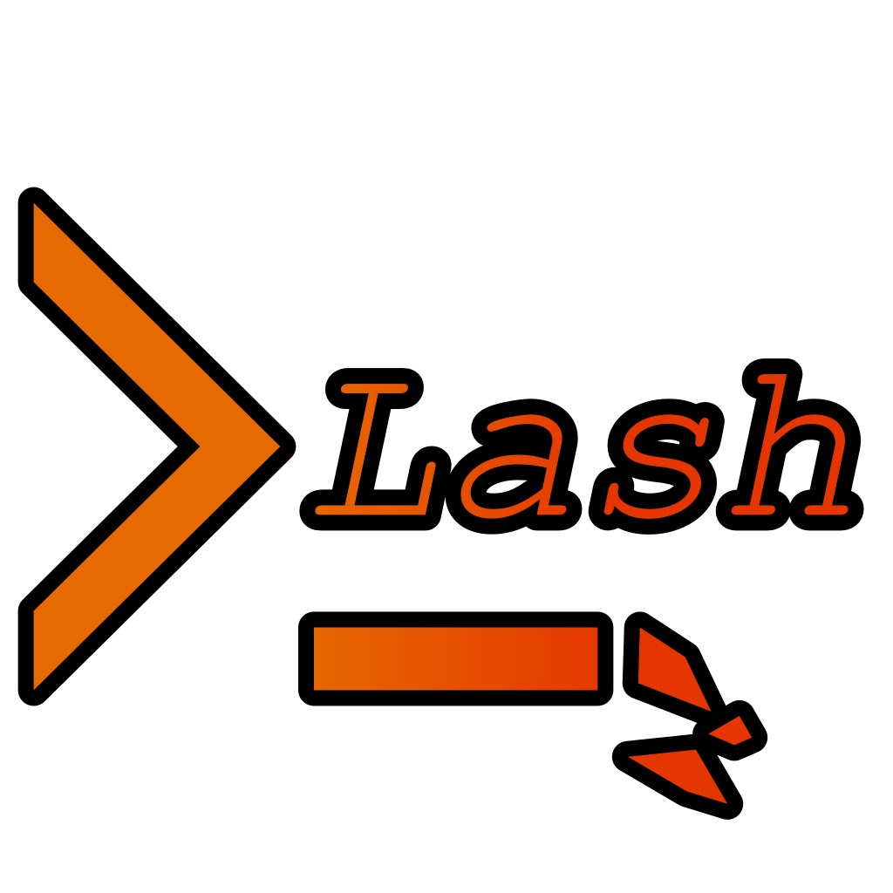
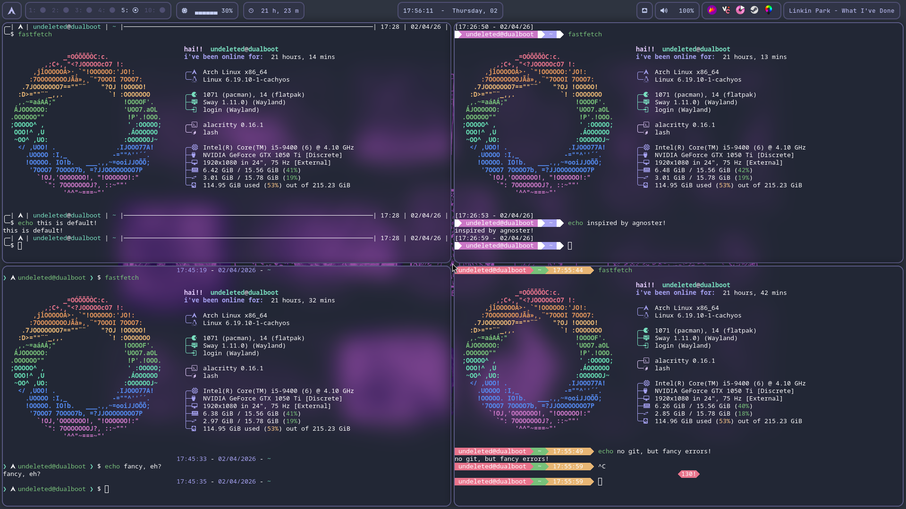

# lash

<p align="center">
  
</p>

<p align="center">
  
  
  
</p>

<p align="center">
  
</p>

# wgat it is
ai generated golang slop code linux shell made for some thingimajig, only contribute with ai code  
lash = larp shell  
fart  
since we are actually adding a ton of good features, since this is a shell made in 2026, we are adding lots of conveniant and cool features, which lack in famous shells. id never think that a ai linux shell would actually work that well... specially with:  
1. conveniant built in escape codes such as \f (fill line)
2. \g (git integration)
3. \l (show user distro logo)
4. even more customizable aliases...  
5. fetch builtin  
and much more to come!!  
whenever this thing is FINALLY finished, we hope to see actualy good go devs make this be actually good (as in not ridden with ai stuff), so if you're willingly to contribute with actual good human code, just wait for us to give you the green light, as in, finally typing enough prompts until its deemed done  
# compiling
```
chmod +x build.sh
./build.sh
```
# [roadmap](ROADMAP.md)
# PS1 examples
```
first one is default!
```
```
export PS1="\c{\033[34m\t\033[0m - \033[34m\T{%dd/%mm/%yyyy}\033[0m - \033[36m\w\033[0m \g{- \033[33m‹\g›\033[0m\G{\033[31m!\033[0m}}}\n\033[36m❯\033[0m \l \033[32m\u@\h\033[0m \033[36m❯ \033[0m$ "
```
```
export PS1="\n[\t - \T{%dd/%mm/%yy}\g{ - \g\G!}\x{ - \X}]\n\033[45m█ \u@\h \033[44m█ \w \033[0m█ "
```
```
export PS1="\x{\c{\033[31m\033[41m\033[0m\033[41m\X!\033[0m\033[31m\033[0m\n}}\033[41m \u@\h \033[42m\033[31m\033[0m\033[42m \w \033[43m\033[32m\033[0m\033[43m \t \033[0m\033[33m█\033[0m "
```
<p align="center">
  
</p>

# contributors
<p align="left">
  <a href="https://github.com/usr-undeleted/lash/graphs/contributors">
    
  </a>
</p>
